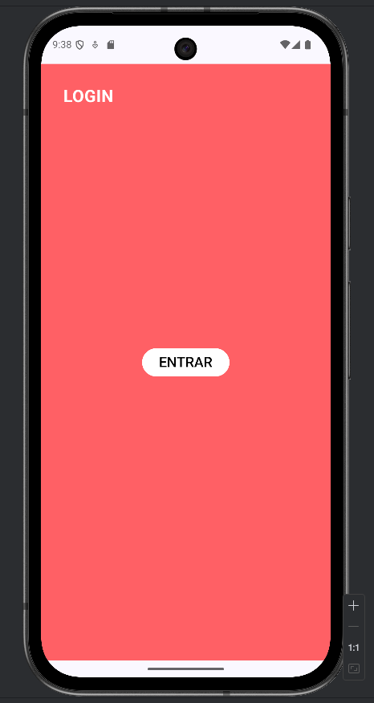
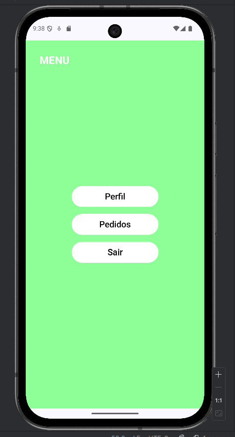
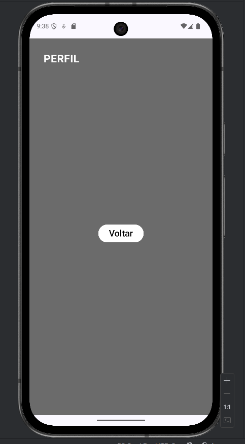
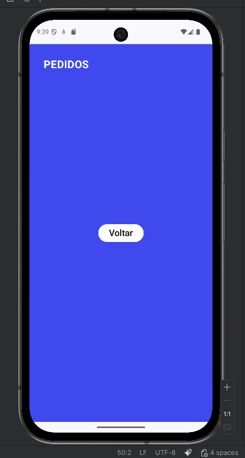

# Kotlin Screens App

Projeto proposto pelo professor Ewerton Luiz para aplicar os conhecimentos vistos em aula (3 SIR, FIAP ACLIMAÇÃO) sobre navegação entre telas no Kotlin. 

Nome: Karine Nascimento Honório da Silva
Turma: 3SIR

## Screenshots

### Tela de Login

### Tela de Menu

### Tela de Perfil

### Tela de Pedidos

